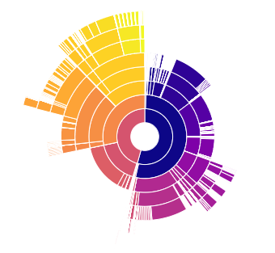
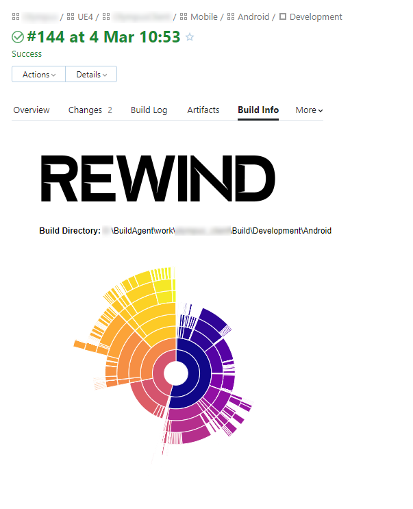

# UE4 Packaged Build Disk Utilisation Visualisation

Use this simple script as a step in your CI tool of choice. The tool will generate a sunburst diagram of the disk utilization of packaged UE4 builds for either Win64 or Android platforms.

# Synopsis

    ./pak-viz.py --help

    ./pak-viz.py ExampleBuild my-dest-dir

    ./pak-viz.py ExampleBuild my-dest-dir --unreal_pak U:/bin/UnrealPak.exe

# Description

Accepts an input and output directory.

Within the input directory, searches for an `.obb` or `.apk` file. In the case of the latter, searches
for an .obb as `assets/.obb.png` and process if found.

An `.pak` file is sought in the `.obb` 's `/ProjectName/Content/Paks/`, and if found, is processed through
`UnrealPak.exe`, and then a JSON tree is created of the directory structure, and added to a
d3 sunburst visualisation, which is then saved to the specified destination directory as `pak-viz.html`

# Example diagram in CI

